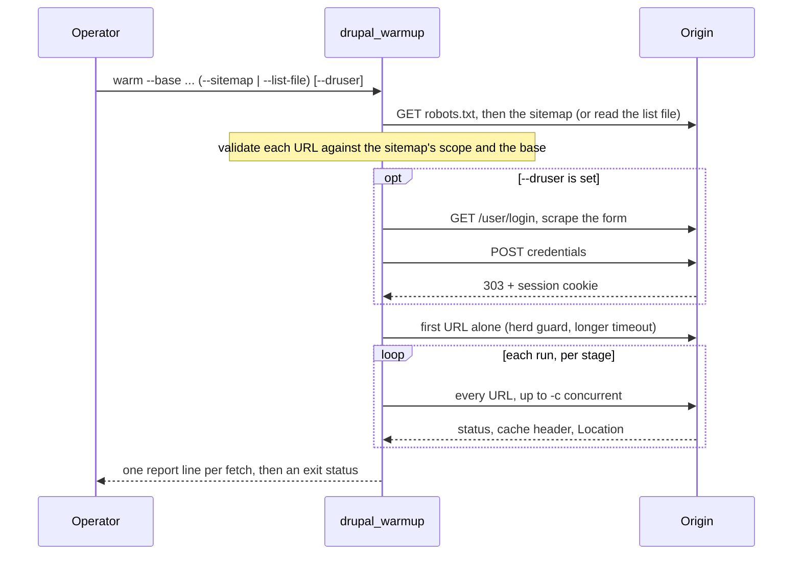

# Design

This document describes the actors in the system and the actions the tool
takes, so a reader can follow every request the tool makes and why.

## Actors

- **Operator**: the person or runbook step that runs `drupal_warmup`,
  supplies `--base` and the flags, and reads the report and exit status.
- **drupal_warmup**: the command-line tool itself.
- **Origin**: the web site being warmed. It serves `robots.txt`,
  the XML sitemap, the pages, and, for a Drupal site, the login form.
  It is the public edge for HTML, which is what visitors reach.
- **Asset CDN** (optional): a separate host that fronts a page's images,
  CSS and JS. The tool warms HTML through the origin, not the CDN;
  assets are out of scope unless listed in the sitemap.
- **Xdebug** (the `debug` command only): the step debugger that the
  `XDEBUG_SESSION` trigger cookie activates on the origin's PHP process.

## Actions: the `warm` command

1. **Enumerate**: read URLs from the sitemap (discovered via `robots.txt`
   or the default path, index followed one level) or from a list file.
2. **Validate scope**: an entry outside its sitemap's scope is reported and,
   without `--lax`, not fetched; an entry outside `--base` is never fetched,
   because credentials travel with every request.
3. **Log in** (optional): only when `--druser` is set.
4. **First fetch alone**: one request pays a cold cache rebuild, so the rest
   do not stampede it.
5. **Fan out**: fetch every URL up to `-c` at a time, `--runs` times.
   With a login this runs twice: an authenticated stage, then an anonymous
   stage that fills the page cache the session bypassed.
6. **Detect redirects**: a redirected URL means a stale list; it is reported
   and, without `--follow`, counts as a failure.
7. **Report**: one line per fetch on standard output; the last run decides
   the exit status.

## Actions: the other commands

- **`list`**: enumerate and print the URLs, fetching none. The dry run.
- **`debug`**: fetch given URLs one at a time with the `XDEBUG_SESSION`
  trigger set, never following redirects, printing the response headers.
- **`version`**: print the build version.

## Trust boundary

Credentials, the basic-auth password, the Drupal login, and the Xdebug
trigger, are sent only to the host named by `--base`. The tool reads public
pages, stores nothing, and sends nothing to any third party. Logs never
carry credential values; see the security notes in [SECURITY.md](../SECURITY.md).
